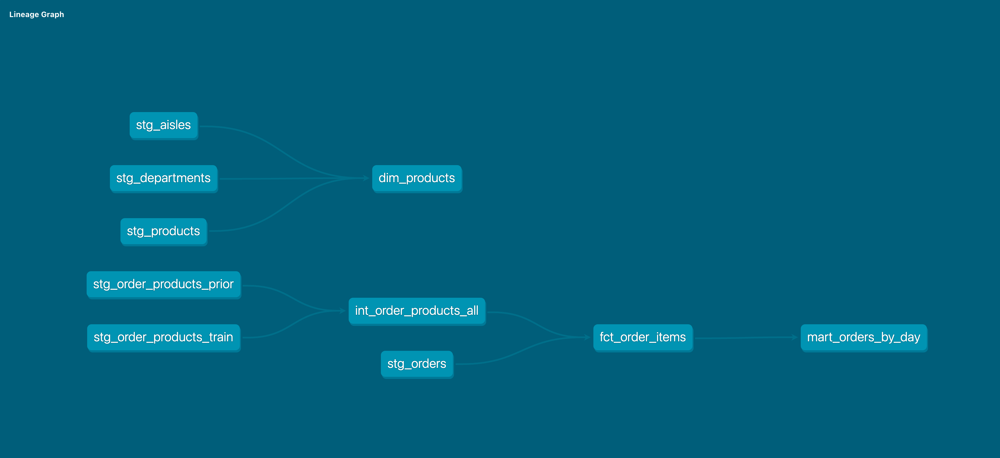

# Instacart Analytics Pipeline (Snowflake + dbt)

## Overview
This project builds an end-to-end analytics pipeline on the Instacart dataset using Snowflake and dbt. The goal was to transform raw Instacart order data into a structured dimensional model that supports analysis of customer shopping behavior.

## Tools Used
- Snowflake (data warehouse)
- dbt (data transformations & modeling)
- SQL
- VS Code

## Dataset

This project uses the Instacart dataset from Kaggle:

https://www.kaggle.com/datasets/psparks/instacart-market-basket-analysis

## Project Architecture

This project follows a layered data modeling approach:

- **RAW**: Source tables loaded into Snowflake
- **STAGING**: Cleaned and standardized raw source data
- **INTERMEDIATE**: Combined and transformed datasets (e.g., prior + train orders)
- **DIMENSIONS**: Descriptive attributes (products, aisles, departments)
- **FACT**: Transactional table of order items
- **MART**: Aggregated business-ready analytics


## Key Models

stg_orders: Cleans order-level data and derives day-of-the-week names

stg_order_products_prior / train: Cleans order-product data from both datasets

int_order_products_all: Combines prior and train datasets

dim_products: Product dimension with aisle and department

fct_order_items: One row per product per order

mart_orders_by_day: Aggregated order trends by day of week


## Example Business Question


Which days of the week have the highest order volume and largest basket sizes?


## Example Insight


Sunday has the highest number of orders and the largest average basket size, indicating customers tend to do larger grocery purchases on weekends.


## Testing

dbt tests were implemented to ensure:

Primary key uniqueness

Non-null constraints

Referential integrity between models

Valid categorical values


## How to Run

1. Set up raw tables in Snowflake

    Run the SQL script located in:
        `sql/snowflake_setup.sql`
    This will create the Instacart tables in Snowflake and you will need to load the data from Kaggle.

1. Clone the repository

2. Create a virtual environment

3. Install dbt

    pip install dbt-snowflake

4. Configure your `profiles.yml` for Snowflake

Example:

```yaml
instacart:
    target: dev
    outputs:
        dev:
          type: snowflake
          account: <your_account>
          user: dbt_instacart
          password: <your_password>
          role: INSTACART_TRANSFORM
          database: INSTACART
          warehouse: COMPUTE_WH
          schema: DEV
          threads: 4
```

5. Run dbt models and tests

```bash
dbt deps
dbt run
dbt test
dbt docs generate
dbt docs serve
```

### Security Note

This project does not include any real credentials. When creating the Snowflake user, you must manually set a password.

## What This Project Demonstrates

End-to-end data pipeline design

Dimensional modeling (fact + dimension tables)

dbt project structuring

SQL-based transformations

Data quality testing

Analytical modeling with marts

Future Improvements

Add additional marts (e.g., product-level or user-level analysis)

Expand testing coverage

## dbt Lineage Graph


